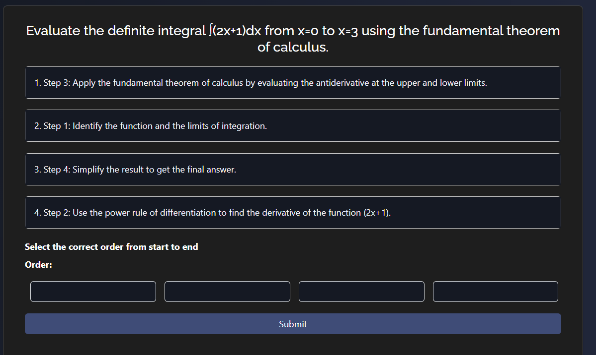

# ExamBuddy

Welcome to **ExamBuddy**, your AI-powered tutoring companion designed to help you excel in math. With ExamBuddy, you can effortlessly resolve your math doubts through an intuitive chatbot interface, making learning engaging and efficient.

## Features

### Answer Mode
- **Topic Selection**: Choose from a variety of math topics to test your understanding.
- **Question Answering**: Answer questions generated by the AI.
- **Verdict Display**: Get a detailed evaluation of your answers, helping you identify areas for improvement.

### Metacognition Mode
- **Topic Selection**: Choose from a variety of math topics to test your understanding.
- **Question Answering**: Answer questions generated by the AI.
- **Verdict Display**: Get a detailed evaluation of your answers, helping you identify areas for improvement.

### Doubt Chatbot
- **Ask Math Question**:Ask any of your Math Doubt.Currntly Model focuses on GCSE exam pattern of Math
- **Get Answer**: Get an answer to your math question instantly, with detailed explanations and step-by
- **Ask Follow Up Question**: Still having doubts? We've got you covered. Ask follow-up questions to clarify any remaining confusion.


### AI Capabilities
- **AI Generation**: Our AI generates relevant math questions tailored to your learning needs.
- **AI Solving**: Complex problems are solved efficiently by our AI.
- **AI Evaluation**: Your answers are evaluated to provide insightful feedback and learning suggestions.

## Getting Started

1. **Sign Up**: Create an account on ExamBuddy to start your learning journey.
2. **Select Mode**: Choose between Answer Mode and Metacognition Mode to get started with Quiz.
3. **Interact with AI**: Use the chatbot to ask questions or answer AI-generated questions.
4. **Review Feedback**: Utilize the detailed feedback to enhance your understanding and skills.
5. **Conquer**: Conquer the Monthly leaderboard by accurately solving your Math.

## Screenshots


*Our Login UI*


*Math Topics to chose from*


*Answer mode*


*Metacognition mode*


*Chat section*

## Website Description

ExamBuddy is more than just a tutoring website; it’s an intelligent learning companion designed to make math learning seamless and effective. Leveraging cutting-edge AI technology, ExamBuddy ensures you get the support you need, whether you're stuck on a problem or looking to test your knowledge. The platform’s dual-mode functionality caters to both immediate problem-solving and in-depth learning, making it an indispensable tool for students at all levels.

### Why Choose ExamBuddy?

- **24/7 Availability**: Access tutoring anytime, anywhere.
- **Personalized Learning**: Get tailored questions and feedback based on your progress.
- **User-Friendly Interface**: Enjoy a seamless and interactive learning experience.
- **Comprehensive Support**: From basic arithmetic to advanced calculus, ExamBuddy covers a wide range of topics.

Join the ExamBuddy community today and transform your math learning experience with the power of AI!

## Setup

### Environment variables

Make sure to set the following environment variables in your `.env` file:

```bash
DATABASE_URI=YOUR_DATABASE_URI
PORT=YOUR_PORT
API_ENDPOINT=YOUR_API_ENDPOINT
SECRET_KEY=YOUR_SECRET_KEY
META_COGNITION_ENDPOINT=YOUR_META_COGNITION_ENDPOINT
SOLUTION_API_ENDPOINT=YOUR_SOLUTION_ENDPOINT
GOOGLE_CLIENT_ID=YOUR_GOOGLE_CLIENT_ID
GOOGLE_CLIENT_SECRET=YOUR_GOOGLE_CLIENT_SECRET
RENDER_OAUTH=YOUR_RENDER_OAUTH
DOUBT_API_ENDPOINT=YOUR_ENDPOINT
```

### Run the server

- Go to the backend folder
```bash
cd backend
```
- Install the dependencies
```bash
npm install -g nodemon && npm install
```

## Important Note

*Please be aware that AI may sometimes produce incorrect or nonsensical answers, known as "hallucinations." Your active engagement, feedback, and continuous use of ExamBuddy will help improve the accuracy and performance of the AI model.*


